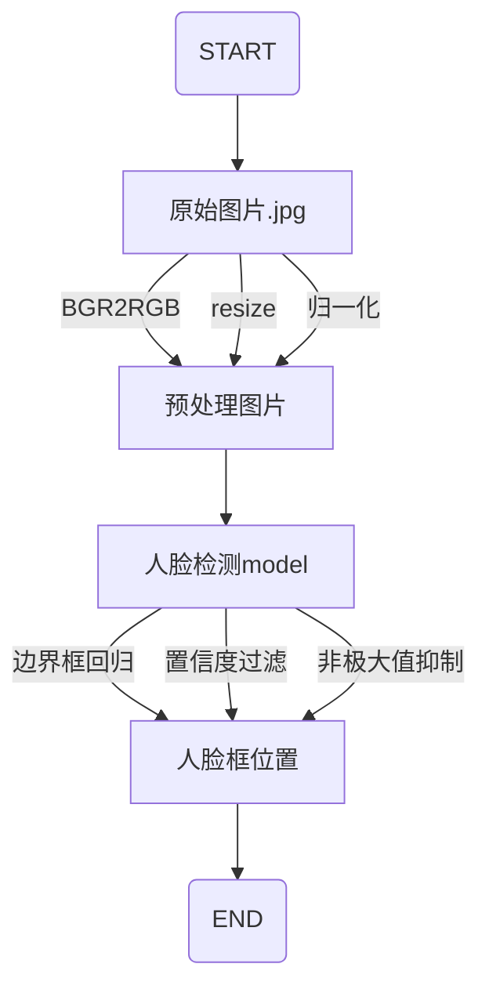

## 名词解释

* 模型训练和推理
  * 模型训练：产生模型的过程。构造模型框架（算法、超参数、损失函数），通过反向传播算法，使用训练数据，得到模型参数。这个过程会耗费大量计算资源。
  * 模型推理：使用模型的过程。输入数据，产生输出结果。

* 推理框架

  * 调用模型所使用的库。推理框架需要与模型格式相匹配。如，tensorflow lite需要以`.tflite`结尾的模型格式。

  * 常见的在手机侧的推理框架包括：tensorflow lite、ncnn、TNN、MNN等

* 人脸检测模型：输入一张人脸图片，输出人脸图片框的位置。

  * 本次使用模型为[Ultra-Light-Fast-Generic-Face-Detector-1MB](https://github.com/Linzaer/Ultra-Light-Fast-Generic-Face-Detector-1MB/blob/master/README_CN.md)。

* bounding box regression边界框回归

  * 属于模型后处理的一步

  * [Ultra-Light-Fast-Generic-Face-Detector-1MB](https://github.com/Linzaer/Ultra-Light-Fast-Generic-Face-Detector-1MB/blob/master/README_CN.md)模型使用了anchor算法，输出的不是人脸框位置，而是相对于anchor的偏移，因此需要对模型的输出进行后处理，转化为人脸框位置

* confidence threshold filter置信度过滤

  * 属于模型后处理
  * 模型会输出多个人脸框，每个人脸框对应一个置信度（称为confidence或score），我们人为设定一个阈值，比如0.7，把低于阈值对应的人脸框过滤掉

* non-maximum suppression非极大值抑制

  * 属于模型后处理
  * 对于一个人脸，模型可能会产生多个重叠的人脸框。非极大值抑制算法根据score和这些框的重叠面积IOU来过滤多余的人脸框

## 人脸检测C++使用方法说明

* `face_ultra/data`目录下存放了测试图片和模型
* `face_ultra/example`目录下存放了C++调用ncnn模型示例
* 该C++代码提供了[Ultra-Light-Fast-Generic-Face-Detector-1MB](https://github.com/Linzaer/Ultra-Light-Fast-Generic-Face-Detector-1MB/blob/master/README_CN.md)人脸检测模型的使用方法示例，该示例实现了：
  * 读入一张`.jpg`图片，模型输出人脸框的位置，将人脸框绘制在图片上，并保存图片
* 为该示例添加了较详细的代码注释
* 该模型和示例遵守MIT协议
* 该示例使用了opencv和ncnn库
  * opencv的作用（不是必须的）：
    * 读取`.jpg`
    * 画框
    * 显示图片
    * 保存图片
  * ncnn的作用（必须）：
    * 色彩通道转换：将BGR转为RGB
    * resize: 将任意大小的图片转为`320*240`（宽*高）像素大小
    * 图片归一化
    * 模型推理，得到模型输出
* 人脸框的描述方法为：以原图片左上角为坐标原点，水平向右为x轴正方向，竖直向下为y轴正方向，单位是像素，用人脸框左上角坐标和右下角坐标描述该人脸框，(x1,y1,x2,y2),即(x1,y1)为人脸框左上角坐标，(x2,y2)为人脸框右下角坐标
* 可以考虑将置信度阈值作为一个可调参数。模型将输出很多人脸框和对应的置信度。在模型后处理过程中，通过置信度阈值来过滤置信度score偏低的人脸框。阈值调高，可以过滤掉更多疑似人脸框，将减少华为云人脸识别调用次数，减少费用，同时会导致更多人脸漏检。模型默认的置信度阈值为0.7。

##　人脸检测过程



## x86-64平台示例

1. 下载ncnn预编译库[ncnn-20210525-ubuntu-1804.zip](https://github.com/Tencent/ncnn/releases/download/20210525/ncnn-20210525-ubuntu-1804.zip)

2. 安装opencv4.2.0

3. 在示例源码目录下执行编译命令，得到`main`可执行文件

   ```shell
   g++ -o main main.cpp UltraFace.cpp -I../include/ -I../include/ncnn -L../lib/opencv -lopencv_highgui -lopencv_imgproc -lopencv_imgcodecs -lopencv_core -L../lib/ncnn -lncnn  -L../lib/x86_64-linux-gnu  -lpthread -lgomp
   ```

4. 测试图片

   ```shell
   ./main ../data/version-RFB/RFB-320.bin ../data/version-RFB/RFB-320.param ../data/test.jpg
   ```

   

## 库说明

* vulkan：ncnn支持vulkan（图形API），使用GPU进行加速。该示例未启用vulkan。因此不需要使用支持vulkan的ncnn预编译库，或者从源码构建时，不需要开启vulkan编译。否则还得先安装vulkan SDK，glslang等一大堆依赖（x86-64平台尝试在示例中开启vulkan推理时，会出现Segmentation fault (core dumped)，暂未解决）
* opencv可能有其他依赖，如果使用，需要解决依赖
* ncnn依赖于`pthread`和`gomp`；`ncnn with vulkan`则依赖更多

### 安卓库

* pre-build直接下载

  * [ncnn](https://github.com/Tencent/ncnn/releases)

  * [opencv](https://opencv.org/releases/)
    * tutorials：https://docs.opencv.org/2.4/doc/tutorials/introduction/android_binary_package/O4A_SDK.html

* 从源代码构建

  * ncnn
    * 源码地址：https://github.com/Tencent/ncnn
    * 源码构建方法：https://github.com/Tencent/ncnn/wiki/how-to-build#build-for-android

### IOS库

* pre-build直接下载

  * [ncnn](https://github.com/Tencent/ncnn/releases)

  * [opencv](https://opencv.org/releases/)

* 从源代码构建

  * ncnn
    * 源码地址：https://github.com/Tencent/ncnn
    * 源码构建方法：https://github.com/Tencent/ncnn/wiki/how-to-build#build-for-ios-on-macos-with-xcode

