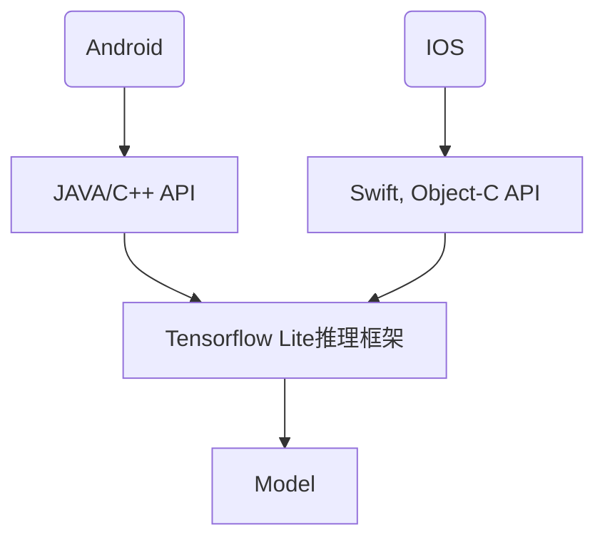

# 人脸检测调研

平台暂定计划为：人脸识别仍然使用华为云接口，人脸检测从大拿云端服务器迁到用户APP，以降低服务器成本

## 人脸检测调研

* 小结
  * 调研的模型分为两种，一种是轻量级模型（前五个），适合在端侧部署；另一种是SOTA（state of the art）模型，在各benchmark数据集上达到最好的效果，是人脸检测领域最先进的算法
  * 人脸检测模型很难直接对比（性能参数太多且不统一）
  * 推荐Ultra-Light-Fast-Generic-Face-Detector-1MB，推荐理由：
    * 极轻量
    * 业界认可：github star 6k左右；腾讯开源框架TNN所做的端侧demo使用的模型
    * 提供了各种硬件的测试结果
    * 对比了知名的轻量人脸检测模型，表现优异
    * 提供了各种推理框架下的模型

* 人脸检测模型很难直接比对

  * 推理速度

    * 不同的模型给出的推理速度跟具体的CPU、GPU等硬件（IPhone、树莓派、台式机）有关
    * 跟图片分辨率有关

  * 准确率/精度/AP等

    * 模型评价指标有很多，各个模型给出的评价指标不一
    * 模型在不同测试集上进行测试，即便评价指标一致，也无法评判模型好坏
    * 跟图片分辨率有关

  * 有的模型只提供了训练代码，需要自己去训练，测试结果受训练影响（超参数设置、训练时间）。因此，虽然有些人给出了不同模型的测试结果，但有随机性，不够权威

  * 同一算法（或paper），会有不同的人去实现（pytorch、tensorflow、caffe等），得到的模型效果也不同

  * paperswithcode上虽然有face detection在不同数据集上的benchmark，可以得到其SOTA（state-of-the-art）算法，但

    * paper上描述的算法为了SOTA，不考虑硬件部署，只为了performance，不适合轻量部署
    * 不一定有源码
    * 源码实现可能跟paper描述的performance有出入
    * 可能只有代码，没有现成模型

* 人脸检测模型对比的正确方法

  1. 提供摄像头实际使用场景的人脸图片做测试
     * 图片质量尽量贴合实际使用场景：如清晰度、夜视等
     * 各使用场景下的图片应具有代表性，例如，不能全部用白天的图片
     * 图片的数量
  2. 应将模型放在手机上进行测试，而不是PC
  3. 用什么样的手机，测试结果更有代表性

* 个人看法

  * 最好使用专门用于端侧的人脸识别模型，比如mtcnn虽然看起来模型大小只有2MB左右，但它没有在端侧进行优化，可能只适合PC

* [Ultra-Light-Fast-Generic-Face-Detector-1MB](https://github.com/Linzaer/Ultra-Light-Fast-Generic-Face-Detector-1MB/blob/master/README_CN.md)

  * 概述

    * 该模型是针对边缘计算设备设计的轻量人脸检测模型。
    * 模型有两个版本，version-slim(主干精简速度略快)，version-RFB(加入了修改后的RFB模块，精度更高)。
    * 提供320x240、640x480不同输入分辨率下使用widerface训练的预训练模型，更好的工作于不同的应用场景。
    * 模型种类：MNN、caffe、ncnn、opencv_dnn、paddle、tensorflow、tensorflow lite

  * 模型大小

    * 默认FP32精度下（.pth）文件大小为 **1.04~1.1MB**，推理框架int8量化后大小为 **300KB** 左右。

  * 计算量或推理速度

    * 320x240的输入分辨率下 **90~109 MFlops**左右。
    * 树莓派4B MNN推理测试耗时 **(单位：ms)**（ARM/A72x4/1.5GHz/输入分辨率 : **320x240** /int8 量化 ） 

    | 模型                                   | 1核    | 2核    | 3核    | 4核     |
    | -------------------------------------- | ------ | ------ | ------ | ------- |
    | libfacedetection v1                    | **28** | **16** | **12** | 9.7     |
    | 官方 Retinaface-Mobilenet-0.25 (Mxnet) | 46     | 25     | 18.5   | 15      |
    | version-slim                           | 29     | **16** | **12** | **9.5** |
    | version-RFB                            | 35     | 19.6   | 14.8   | 11      |

    - iPhone 6s Plus MNN (版本Tag：0.2.1.5) 推理测试耗时（输入分辨率 : **320x240** ）[数据来自MNN官方](https://www.yuque.com/mnn/en/demo_zoo#bXsRY)

    | 模型                                                         | 耗时（ms） |
    | ------------------------------------------------------------ | ---------- |
    | [slim-320](https://github.com/Linzaer/Ultra-Light-Fast-Generic-Face-Detector-1MB/blob/master/MNN/model/version-slim/slim-320.mnn) | 6.33       |
    | [RFB-320](https://github.com/Linzaer/Ultra-Light-Fast-Generic-Face-Detector-1MB/blob/master/MNN/model/version-RFB/RFB-320.mnn) | 7.8        |

    - [Kendryte K210](https://kendryte.com/) NNCase 推理测试耗时 (RISC-V/400MHz/输入分辨率 : **320x240** /int8 量化) [数据来自NNCase](https://github.com/kendryte/nncase/tree/master/examples/fast_facedetect)

    | Model                                                        | Inference Latency(ms) |
    | ------------------------------------------------------------ | --------------------- |
    | [slim-320](https://github.com/kendryte/nncase/tree/master/examples/fast_facedetect/k210/kpu_fast_facedetect_example/slim-320.kmodel) | 65.6                  |
    | [RFB-320](https://github.com/kendryte/nncase/tree/master/examples/fast_facedetect/k210/kpu_fast_facedetect_example/RFB-320.kmodel) | 164.8                 |

  * 准确率/精度/AP等

    **Widerface测试**

     - 在WIDER FACE val集测试精度（单尺度输入分辨率：**320*240 或按最大边长320等比缩放**） 

    | 模型                              | Easy Set  | Medium Set | Hard Set  |
    | --------------------------------- | --------- | ---------- | --------- |
    | libfacedetection v1（caffe）      | 0.65      | 0.5        | 0.233     |
    | libfacedetection v2（caffe）      | 0.714     | 0.585      | 0.306     |
    | Retinaface-Mobilenet-0.25 (Mxnet) | 0.745     | 0.553      | 0.232     |
    | version-slim                      | 0.77      | 0.671      | 0.395     |
    | version-RFB                       | **0.787** | **0.698**  | **0.438** |

     - 在WIDER FACE val集测试精度（单尺度输入分辨率：**VGA 640*480 或按最大边长640等比缩放** ） 

    | 模型                              | Easy Set  | Medium Set | Hard Set  |
    | --------------------------------- | --------- | ---------- | --------- |
    | libfacedetection v1（caffe）      | 0.741     | 0.683      | 0.421     |
    | libfacedetection v2（caffe）      | 0.773     | 0.718      | 0.485     |
    | Retinaface-Mobilenet-0.25 (Mxnet) | **0.879** | 0.807      | 0.481     |
    | version-slim                      | 0.853     | 0.819      | 0.539     |
    | version-RFB                       | 0.855     | **0.822**  | **0.579** |

* [libfacedetection](https://github.com/ShiqiYu/libfacedetection)

  * 概述

    * 基于[github训练](https://github.com/sirius-ai/MobileFaceNet_TF)的pb模型，转换为tflite模型
    * 模型输入：112*112

  * 模型大小：

    * caffe：3.34MB

  * 计算量或推理速度

    **CNN-based Face Detection on Intel CPU**

    | Method             | Time          | FPS           | Time         | FPS          |
    | ------------------ | ------------- | ------------- | ------------ | ------------ |
    |                    | X64           | X64           | X64          | X64          |
    |                    | Single-thread | Single-thread | Multi-thread | Multi-thread |
    | cnn (CPU, 640x480) | 58.06ms.      | 17.22         | 12.93ms      | 77.34        |
    | cnn (CPU, 320x240) | 13.77ms       | 72.60         | 3.19ms       | 313.14       |
    | cnn (CPU, 160x120) | 3.26ms        | 306.81        | 0.77ms       | 1293.99      |
    | cnn (CPU, 128x96)  | 1.41ms        | 711.69        | 0.49ms       | 2027.74      |

  * Minimal face size ~10x10

    * Intel(R) Core(TM) i7-1065G7 CPU @ 1.3GHz

    **CNN-based Face Detection on ARM Linux (Raspberry Pi 4 B)**

    | Method             | Time          | FPS           | Time         | FPS          |
    | ------------------ | ------------- | ------------- | ------------ | ------------ |
    |                    | Single-thread | Single-thread | Multi-thread | Multi-thread |
    | cnn (CPU, 640x480) | 492.99ms      | 2.03          | 149.66ms     | 6.68         |
    | cnn (CPU, 320x240) | 116.43ms      | 8.59          | 34.19ms      | 29.25        |
    | cnn (CPU, 160x120) | 27.91ms       | 35.83         | 8.43ms       | 118.64       |
    | cnn (CPU, 128x96)  | 17.94ms       | 55.74         | 5.24ms       | 190.82       |

    <!-- * Face detection only, and no landmark detection included. -->

  * Minimal face size ~10x10

    * Raspberry Pi 4 B, Broadcom BCM2835, Cortex-A72 (ARMv8) 64-bit SoC @ 1.5GHz

  * 准确率/精度/AP等

    * Wider Face：AP_easy=0.834, AP_medium=0.824, AP_hard=0.708

* [MobileFaceNet](https://zhuanlan.zhihu.com/p/301188185)

  * 概述
    * 模型来源于github：https://github.com/sirius-ai/MobileFaceNet_TF
    * 模型输入：320*240
  * 模型大小：
    * caffe：5.2MB
    * openvino：2.57MB
  * 计算量或推理速度
    * 1000FPS （X64, 多线程，Intel CPU, 160x120）
    * 高通骁龙625: 260ms
  * 准确率/精度/AP等
    * LFW数据集99.4%

* [mtcnn-ncnn](https://github.com/deepinsight/mtcnn-ncnn)

  * 概述
    * caffe版的mtcnn模型转为ncnn
  * 模型大小
    * caffe: 3层模型文件加起来查不到2M
    * ncnn: 3层模型文件加起来竟然只有20k左右
  * 计算量或推理速度
    * 项目未提供
  * 准确率/精度/AP等
    * 项目未提供

* [RetinaFace MobileNet0.25](https://github.com/deepinsight/insightface/issues/669)

  * 概述
    * RetinaFace是2019年WIDER Face (Hard)数据集SOTA算法，几乎与当前最好的TinaFace相当，模型大小104MB
    * 此轻量模型结合了RetinaFace和MobileNet0.25 
  * 模型大小
    * mxnet：1.68MB
  * 计算量或推理速度
  * 准确率/精度/AP等（测试条件：两块1080Ti）
    * WIDER Face Hard 单尺度测试：0.791
    * WIDER Face Hard 多尺度测试：0.825

* [TinaFace](https://github.com/Media-Smart/vedadet/tree/main/configs/trainval/tinaface)

  * 概述

    * 到目前为止，WIDER Face (Hard)数据集上最好的算法
    * papers with code：https://paperswithcode.com/paper/tinaface-strong-but-simple-baseline-for-face

  * 模型大小

    * R50-FPN-GN-DCN：145MB

    * R50-FPN-BN：143.4MB

  * 计算量或推理速度

  * 准确率/精度/AP等（在各数据集上的AP）

    | model          | figure size  | AP50(VOC12) | easy  | medium | hard  |
    | -------------- | ------------ | ----------- | ----- | ------ | ----- |
    | R50-FPN-GN-DCN | (1100, 1650) | 0.923       | 0.963 | 0.957  | 0.930 |
    | R50-FPN-BN     | (1100, 1650) | 0.916       | 0.957 | 0.954  | 0.922 |

* [DSFD](https://github.com/Tencent/FaceDetection-DSFD)

  * 概述
    * 腾讯
  * 模型大小
    * 458MB
  * 计算量或推理速度
  * 准确率/精度/AP等
    * 在FDDB数据集上AP达到0.991，排名第一
    * 在WIDER Face (Easy)数据集上AP达到0.960，排名第二  
    * 在WIDER Face (Hard)数据集上AP达到0.900，排名第四
    * 在WIDER Face (Medium)数据集上AP达到0.953，排名第二                

* [lightDSFD](https://github.com/lijiannuist/lightDSFD)

  * 概述
    * 轻量版DSFD
  * 模型大小
    * 3.88M
  * 计算量或推理速度
    * 在Nvidia Tesla P40，网络执行时间13ms
  * 准确率/精度/AP等（基于paper）
    * Easy Set：0.891
    * Medium：0.864
    * Hard Set：0.469

* [SRN]()

  * 概述
    * paperswithcode：https://paperswithcode.com/paper/selective-refinement-network-for-high
    * 开源实现：https://github.com/ChiCheng123/SRN
  * 模型大小
    * 407.4MB
  * 计算量或推理速度
  * 准确率/精度/AP等（基于paper）
    * 在AFW数据集上AP达到0.953，排名第一
    * 在PASCAL Face数据集上AP达到0.953，排名第一
    * 在WIDER Face (Easy)数据集上AP达到0.959，排名第三
    * 在WIDER Face (Hard)数据集上AP达到0.896，排名第六
    * 在WIDER Face (Medium)数据集上AP达到0.948，排名第三

* [MTCNN](https://github.com/kuaikuaikim/DFace)

  * 概述
    * 2016年达到SOTA水平
  * 模型大小
    * 固化为.pb后大小为1.91MB
  * 计算量或推理速度
  * 准确率/精度/AP等（基于paper）
    * 在WIDER Face (Easy)数据集上AP达到0.851，排名第八
    * 在WIDER Face (Hard)数据集上AP达到0.607，排名第二十
    * 在WIDER Face (Medium)数据集上AP达到0.820，排名第十六

## 部署相关（端侧推理框架等）

* 小结
  * 推理框架众多，Tensorflow lite提供了更丰富的API，而其他推理框架只有C++
  * 其他推理框架中，NCNN开源最早
  * 建议选择Tensorflow lite或NCNN

* Tensorflow lite



* 其他推理框架

  ```mermaid
  graph TD
  
  A(Android) -->  B[C/C++ API]
  D(IOS) --> B
  B --> F[NCNN, TNN, MNN等推理框架]
  F --> G[Model]
  ```

  

* [AOE (AI on Edge，终端智能，边缘计算) 是一个终端侧AI集成运行时环境 (IRE)](https://github.com/didi/AoE)

  * 不提供推理框架，只为了业务与推理框架进行解耦，感觉我们不需要

  * 适配推理框架：TensorFlow Lite，PyTorch，MNN，NCNN，Tengine
  * Android：JAVA
  * IOS

* [Android,IOS人脸检测开发工具](https://developers.google.com/ml-kit/vision/face-detection/ios)

* [一个mtcnn和ncnn的demo实现](https://github.com/yangfly/face.ncnn/tree/master/mtcnn)

* Tensorflow Lite

  * 谷歌

  * build: https://tensorflow.google.cn/lite/guide/build_android
  * [api](https://www.tensorflow.org/lite/api_docs/): python, java, swift, c++
  * Android: JAVA, C++
  * IOS: Swift, Object-C
  * 优势：提供详细demo；提供各种API
  * 劣势：其他框架训练的模型不方便转换

* Ncnn

  * 腾讯

  * Android: 
    * 图片分类demo：https://blog.csdn.net/qq_33200967/article/details/82421089

* MNN

  * 阿里巴巴

  * api: python (beta)
  * Android: https://www.yuque.com/mnn/en/build_android

* TNN

  * 腾讯

  * Android, IOS demo: https://github.com/Tencent/TNN/blob/master/doc/cn/user/demo.md

##　交付

* 模型、demo用例
* 模型输入规定大小的图片，输出人脸框位置
* 模型无需进行landmark
* 手机将人脸框裁剪出来，发送到华为云做人脸识别