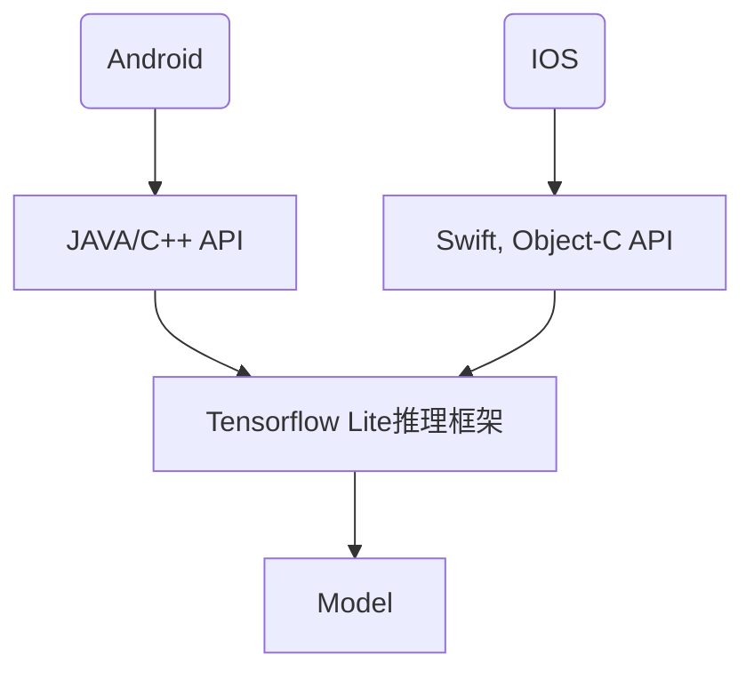

## 基础名词

* face recognition : 人脸识别，1：N的比对，不知道你是谁，直接和数据库里的人脸比对，得出一个结果。例，公共场所摄像头识别犯罪嫌疑人

* face verification (face authentication): 人脸验证，1：1的比对，你说你是A，那就拿你的人脸和A的人脸进行比对，给出YES or NO。例，火车站验证人证一致

* 模型评价指标：

  * 召回率、查全率、真阳率、命中率：TP/(TP+FN)

  * 漏检率、漏报率：FN/(TP+FN)

  * 误检率、误报率、假阳率、虚报率：FP/(FP+TN)

  * 特异度specificity： TN/(FP+TN)

  * AP

    |                     | positive (actual)        | negative (actual)        |
    | ------------------- | ------------------------ | ------------------------ |
    | positive (expected) | TP (true positive)       | FP (false positive) 误检 |
    | negative (expected) | FN (false negative) 漏检 | TN (true negative)       |

## 人脸检测调研

* 小结
  * 调研的模型分为两种，一种是轻量级模型（前五个），适合在端侧部署；另一种是SOTA（state of the art）模型，在各benchmark数据集上达到最好的效果，是人脸检测领域最先进的算法
  * 人脸检测模型很难直接对比（性能参数太多且不统一）
  * 推荐Ultra-Light-Fast-Generic-Face-Detector-1MB，推荐理由：
    * 极轻量
    * 业界认可：github star 6k左右；腾讯开源框架TNN所做的端侧demo使用的模型

* 人脸检测、人脸识别放在端侧（手机或摄像头），可以降低平台运行人脸检测服务器成本（大约每月3万）和调用华为云人脸识别接口的成本。

* 用华为云人脸识别的好处是，人脸识别准确率普遍不高，可以甩锅给华为，因为我们的摄像头产品要通过华为的验收。当自研人脸识别算法和华为提供的人脸识别算法在相等水平时，使用华为产品对我们产品快速上市更有利

* 人脸识别最好放在摄像头上，因为放在手机上会产生耗电，用户不一定同意（智慧生活也不一定允许我们在后台进行人脸识别）。而摄像头是长电设备，不担心耗电问题。但摄像头的内存小，不一定能把模型文件加载到内存中。

* 目前人脸检测和人脸识别的模型都比较大，即便是轻量模型，也在4-5M左右。seetaface6人脸检测模型是4.1M，人脸识别模型是102.6M，轻量人脸识别模型是4.7M
  * https://aijishu.com/a/1060000000106193
  * 在摄像头内存不足的情况下，可尝试调研人脸检测模型能否控制在1M以内。仅将人脸检测放在摄像头，将人脸识别放在手机侧或云平台
  
* 人脸检测模型很难直接比对

  * 推理速度

    * 不同的模型给出的推理速度跟具体的CPU、GPU等硬件（IPhone、树莓派、台式机）有关
    * 跟图片分辨率有关

  * 准确率/精度/AP等

    * 模型评价指标有很多，各个模型给出的评价指标不一
    * 模型在不同测试集上进行测试，即便评价指标一致，也无法评判模型好坏
    * 跟图片分辨率有关

  * 有的模型只提供了训练代码，需要自己去训练，测试结果受训练影响（超参数设置、训练时间）。因此，虽然有些人给出了不同模型的测试结果，但有随机性，不够权威

  * 同一算法（或paper），会有不同的人去实现（pytorch、tensorflow、caffe等），得到的模型效果也不同

  * paperswithcode上虽然有face detection在不同数据集上的benchmark，可以得到其SOTA（state-of-the-art）算法，但

    * paper上描述的算法为了SOTA，不考虑硬件部署，只为了performance，不适合轻量部署
    * 不一定有源码
    * 源码实现可能跟paper描述的performance有出入
    * 可能只有代码，没有现成模型

* 人脸检测模型对比的正确方法

  1. 提供摄像头实际使用场景的人脸图片做测试
     * 图片质量尽量贴合实际使用场景：如清晰度、夜视等
     * 各使用场景下的图片应具有代表性，例如，不能全部用白天的图片
     * 图片的数量
  2. 应将模型放在手机上进行测试，而不是PC
  3. 用什么样的手机，测试结果更有代表性

* 个人看法

  * 最好使用专门用于端侧的人脸识别模型，比如mtcnn虽然看起来模型大小只有2MB左右，但它没有在端侧进行优化，可能只适合PC

* [Ultra-Light-Fast-Generic-Face-Detector-1MB](https://github.com/Linzaer/Ultra-Light-Fast-Generic-Face-Detector-1MB/blob/master/README_CN.md)

  * 概述

    * 该模型是针对边缘计算设备设计的轻量人脸检测模型。
    * [基于ssd修改。速度超级快，MNN上测试，MTCNN得20ms，该模型只要4ms。精度上不如MTCNN](https://blog.csdn.net/qq_14845119/article/details/102729567)
    * 模型有两个版本，version-slim(主干精简速度略快)，version-RFB(加入了修改后的RFB模块，精度更高)。
    * 提供320x240、640x480不同输入分辨率下使用widerface训练的预训练模型，更好的工作于不同的应用场景。
    * 模型种类：MNN、caffe、ncnn、opencv_dnn、paddle、tensorflow、tensorflow lite

  * 模型大小

    * 默认FP32精度下（.pth）文件大小为 **1.04~1.1MB**，推理框架int8量化后大小为 **300KB** 左右。

  * 计算量或推理速度

    * 320x240的输入分辨率下 **90~109 MFlops**左右。
    * 树莓派4B MNN推理测试耗时 **(单位：ms)**（ARM/A72x4/1.5GHz/输入分辨率 : **320x240** /int8 量化 ） 

    | 模型                                   | 1核    | 2核    | 3核    | 4核     |
    | -------------------------------------- | ------ | ------ | ------ | ------- |
    | libfacedetection v1                    | **28** | **16** | **12** | 9.7     |
    | 官方 Retinaface-Mobilenet-0.25 (Mxnet) | 46     | 25     | 18.5   | 15      |
    | version-slim                           | 29     | **16** | **12** | **9.5** |
    | version-RFB                            | 35     | 19.6   | 14.8   | 11      |

    - iPhone 6s Plus MNN (版本Tag：0.2.1.5) 推理测试耗时（输入分辨率 : **320x240** ）[数据来自MNN官方](https://www.yuque.com/mnn/en/demo_zoo#bXsRY)

    | 模型                                                         | 耗时（ms） |
    | ------------------------------------------------------------ | ---------- |
    | [slim-320](https://github.com/Linzaer/Ultra-Light-Fast-Generic-Face-Detector-1MB/blob/master/MNN/model/version-slim/slim-320.mnn) | 6.33       |
    | [RFB-320](https://github.com/Linzaer/Ultra-Light-Fast-Generic-Face-Detector-1MB/blob/master/MNN/model/version-RFB/RFB-320.mnn) | 7.8        |

    - [Kendryte K210](https://kendryte.com/) NNCase 推理测试耗时 (RISC-V/400MHz/输入分辨率 : **320x240** /int8 量化) [数据来自NNCase](https://github.com/kendryte/nncase/tree/master/examples/fast_facedetect)

    | Model                                                        | Inference Latency(ms) |
    | ------------------------------------------------------------ | --------------------- |
    | [slim-320](https://github.com/kendryte/nncase/tree/master/examples/fast_facedetect/k210/kpu_fast_facedetect_example/slim-320.kmodel) | 65.6                  |
    | [RFB-320](https://github.com/kendryte/nncase/tree/master/examples/fast_facedetect/k210/kpu_fast_facedetect_example/RFB-320.kmodel) | 164.8                 |

  * 准确率/精度/AP等

    **Widerface测试**

     - 在WIDER FACE val集测试精度（单尺度输入分辨率：**320*240 或按最大边长320等比缩放**） 

    | 模型                              | Easy Set  | Medium Set | Hard Set  |
    | --------------------------------- | --------- | ---------- | --------- |
    | libfacedetection v1（caffe）      | 0.65      | 0.5        | 0.233     |
    | libfacedetection v2（caffe）      | 0.714     | 0.585      | 0.306     |
    | Retinaface-Mobilenet-0.25 (Mxnet) | 0.745     | 0.553      | 0.232     |
    | version-slim                      | 0.77      | 0.671      | 0.395     |
    | version-RFB                       | **0.787** | **0.698**  | **0.438** |

     - 在WIDER FACE val集测试精度（单尺度输入分辨率：**VGA 640*480 或按最大边长640等比缩放** ） 
    
    | 模型                              | Easy Set  | Medium Set | Hard Set  |
    | --------------------------------- | --------- | ---------- | --------- |
    | libfacedetection v1（caffe）      | 0.741     | 0.683      | 0.421     |
    | libfacedetection v2（caffe）      | 0.773     | 0.718      | 0.485     |
    | Retinaface-Mobilenet-0.25 (Mxnet) | **0.879** | 0.807      | 0.481     |
    | version-slim                      | 0.853     | 0.819      | 0.539     |
    | version-RFB                       | 0.855     | **0.822**  | **0.579** |

* [libfacedetection](https://github.com/ShiqiYu/libfacedetection)
  
  * 概述
    * 基于[github训练](https://github.com/sirius-ai/MobileFaceNet_TF)的pb模型，转换为tflite模型
    * 模型输入：112*112
    
  * 模型大小：
    * caffe：3.34MB
    
  * 计算量或推理速度
  
    **CNN-based Face Detection on Intel CPU**
  
    | Method             | Time          | FPS           | Time         | FPS          |
    | ------------------ | ------------- | ------------- | ------------ | ------------ |
    |                    | X64           | X64           | X64          | X64          |
    |                    | Single-thread | Single-thread | Multi-thread | Multi-thread |
    | cnn (CPU, 640x480) | 58.06ms.      | 17.22         | 12.93ms      | 77.34        |
    | cnn (CPU, 320x240) | 13.77ms       | 72.60         | 3.19ms       | 313.14       |
    | cnn (CPU, 160x120) | 3.26ms        | 306.81        | 0.77ms       | 1293.99      |
    | cnn (CPU, 128x96)  | 1.41ms        | 711.69        | 0.49ms       | 2027.74      |
    
  * Minimal face size ~10x10
    * Intel(R) Core(TM) i7-1065G7 CPU @ 1.3GHz
    
    **CNN-based Face Detection on ARM Linux (Raspberry Pi 4 B)**
    
    | Method             | Time          | FPS           | Time         | FPS          |
    | ------------------ | ------------- | ------------- | ------------ | ------------ |
    |                    | Single-thread | Single-thread | Multi-thread | Multi-thread |
    | cnn (CPU, 640x480) | 492.99ms      | 2.03          | 149.66ms     | 6.68         |
    | cnn (CPU, 320x240) | 116.43ms      | 8.59          | 34.19ms      | 29.25        |
    | cnn (CPU, 160x120) | 27.91ms       | 35.83         | 8.43ms       | 118.64       |
    | cnn (CPU, 128x96)  | 17.94ms       | 55.74         | 5.24ms       | 190.82       |
  
    <!-- * Face detection only, and no landmark detection included. -->
  * Minimal face size ~10x10
    * Raspberry Pi 4 B, Broadcom BCM2835, Cortex-A72 (ARMv8) 64-bit SoC @ 1.5GHz
  
  * 准确率/精度/AP等
  
    * Wider Face：AP_easy=0.834, AP_medium=0.824, AP_hard=0.708
  
* [MobileFaceNet](https://zhuanlan.zhihu.com/p/301188185)
  
  * 概述
    * 模型来源于github：https://github.com/sirius-ai/MobileFaceNet_TF
    * 模型输入：320*240
  * 模型大小：
    * caffe：5.2MB
    * openvino：2.57MB
  * 计算量或推理速度
    * 1000FPS （X64, 多线程，Intel CPU, 160x120）
    * 高通骁龙625: 260ms
  * 准确率/精度/AP等
    * LFW数据集99.4%
  
* [mtcnn-ncnn](https://github.com/deepinsight/mtcnn-ncnn)

  * 概述
    * caffe版的mtcnn模型转为ncnn
  * 模型大小
    * caffe: 3层模型文件加起来查不到2M
    * ncnn: 3层模型文件加起来竟然只有20k左右
  * 计算量或推理速度
    * 项目未提供
  * 准确率/精度/AP等
    * 项目未提供

* [RetinaFace MobileNet0.25](https://github.com/deepinsight/insightface/issues/669)

  * 概述
    * RetinaFace是2019年WIDER Face (Hard)数据集SOTA算法，几乎与当前最好的TinaFace相当，模型大小104MB
    * 此轻量模型结合了RetinaFace和MobileNet0.25 
  * 模型大小
    * mxnet：1.68MB
  * 计算量或推理速度
  * 准确率/精度/AP等（测试条件：两块1080Ti）
    * WIDER Face Hard 单尺度测试：0.791
    * WIDER Face Hard 多尺度测试：0.825

* [TinaFace](https://github.com/Media-Smart/vedadet/tree/main/configs/trainval/tinaface)

  * 概述

    * 到目前为止，WIDER Face (Hard)数据集上最好的算法
    * papers with code：https://paperswithcode.com/paper/tinaface-strong-but-simple-baseline-for-face

  * 模型大小

    * R50-FPN-GN-DCN：145MB

    * R50-FPN-BN：143.4MB

  * 计算量或推理速度

  * 准确率/精度/AP等（在各数据集上的AP）

    | model          | figure size  | AP50(VOC12) | easy  | medium | hard  |
    | -------------- | ------------ | ----------- | ----- | ------ | ----- |
    | R50-FPN-GN-DCN | (1100, 1650) | 0.923       | 0.963 | 0.957  | 0.930 |
    | R50-FPN-BN     | (1100, 1650) | 0.916       | 0.957 | 0.954  | 0.922 |

* [DSFD](https://github.com/Tencent/FaceDetection-DSFD)
  * 概述
    * 腾讯
  * 模型大小
    * 458MB
  * 计算量或推理速度
  * 准确率/精度/AP等
    * 在FDDB数据集上AP达到0.991，排名第一
    * 在WIDER Face (Easy)数据集上AP达到0.960，排名第二  
    * 在WIDER Face (Hard)数据集上AP达到0.900，排名第四
    * 在WIDER Face (Medium)数据集上AP达到0.953，排名第二                

* [lightDSFD](https://github.com/lijiannuist/lightDSFD)
  
  * 概述
    * 轻量版DSFD
  * 模型大小
    * 3.88M
  * 计算量或推理速度
    * 在Nvidia Tesla P40，网络执行时间13ms
  * 准确率/精度/AP等（基于paper）
    * Easy Set：0.891
    * Medium：0.864
    * Hard Set：0.469
  
* [SRN]()
  
  * 概述
    * paperswithcode：https://paperswithcode.com/paper/selective-refinement-network-for-high
    * 开源实现：https://github.com/ChiCheng123/SRN
  * 模型大小
    * 407.4MB
  * 计算量或推理速度
  * 准确率/精度/AP等（基于paper）
    * 在AFW数据集上AP达到0.953，排名第一
    * 在PASCAL Face数据集上AP达到0.953，排名第一
    * 在WIDER Face (Easy)数据集上AP达到0.959，排名第三
    * 在WIDER Face (Hard)数据集上AP达到0.896，排名第六
    * 在WIDER Face (Medium)数据集上AP达到0.948，排名第三
  
* [MTCNN](https://github.com/kuaikuaikim/DFace)

  * 概述
    * 2016年达到SOTA水平
  * 模型大小
    * 固化为.pb后大小为1.91MB
  * 计算量或推理速度
  * 准确率/精度/AP等（基于paper）
    * 在WIDER Face (Easy)数据集上AP达到0.851，排名第八
    * 在WIDER Face (Hard)数据集上AP达到0.607，排名第二十
    * 在WIDER Face (Medium)数据集上AP达到0.820，排名第十六

## 人脸识别调研

1. [中科院山世光组开源的项目](https://github.com/seetaface/SeetaFaceEngine2/blob/master/example/C++/README.md)或[最新版seetaface6](https://github.com/seetafaceengine)
   * 人脸检测、人脸对齐、人脸识别完整流程
   * 提供了`C++`和`Android`的SDK，无源码
   * android实现：https://blog.csdn.net/qq_36992688/article/details/81454059
2. [dlib](http://dlib.net/)
   * 包含机器学习算法的C++库
   * [人脸识别入门](https://zhuanlan.zhihu.com/p/44169338)
   * [dlib官方人脸识别示例](http://dlib.net/dnn_face_recognition_ex.cpp.html): 99.38% accuracy
3. 实时人脸识别APP
   * 英文：https://medium.com/@estebanuri/real-time-face-recognition-with-android-tensorflow-lite-14e9c6cc53a5
   * 中文翻译：https://zhuanlan.zhihu.com/p/301188185
   * github：https://github.com/estebanuri/face_recognition/tree/master/android

## seetaface6

* 为什么选择seetaface6
  * 免费
  * 模型人脸识别准确率评估比较麻烦（如果在公司实际应用场景下评估，首先得收集上百上千的人脸数据集），最好找公认的好的模型。seetaface6是中科视拓最新开源的商业正式版本，有公司做背书，想来不会太差
  * C++实现，不依赖于第三方库
  * 使用说明文档比较详细
  * 如果自训练人脸识别模型，需要计算资源和人脸数据集，目前不现实。最好找开箱即用的模型。

* 概述

  * `SeetaFace6`是中科视拓最新开源的商业正式版本。此次开源包含了一直以来人脸识别的基本部分，如人脸检测、关键点定位、人脸识别。同时增加了活体检测、人脸质量评估、年龄性别估计、人脸跟踪、口罩检测、带口罩人脸识别、眼睛状态检测。SeetaFace6人脸识别数据量增加到了上亿张图片。
  * **SeetaFace6开放版可以免费用于商用**

  * | 模型名称           | 网络结构       | 速度（I7-6700） | 速度（RK3399） | 特征长度 |
    | ------------------ | -------------- | --------------- | -------------- | -------- |
    | 通用人脸识别       | ResNet-50      | 57ms            | 300ms          | 1024     |
    | 带口罩人脸识别     | ResNet-50      | 34ms            | 150ms          | 512      |
    | 通用人脸识别（小） | Mobile FaceNet | 9ms             | 70ms           | 512      |

  * `SeetaFace6`共开放了三个识别模型，其对比说明如下：

    | 文件名                     | 特征长度 | 一般阈值 | 说明                   |
    | -------------------------- | -------- | -------- | ---------------------- |
    | face_recognizer.csta       | 1024     | 0.62     | 通用场景高精度人脸识别 |
    | face_recognizer_mask.csta  | 512      | 0.48     | 带口罩人脸识别模型     |
    | face_recognizer_light.csta | 512      | 0.55     | 轻量级人脸识别模型     |
  
  * 其中，人脸检测模块SeetaFace Detection采用了一种结合传统人造特征与多层感知机（MLP）的级联结构，在FDDB上达到了84.4%的召回率（100个误检时），并可在单个i7 CPU上实时处理VGA分辨率的图像。
  
    面部特征点定位模块SeetaFace  Alignment通过级联多个深度模型（栈式自编码网络）来回归5个关键特征点（两眼中心、鼻尖和两个嘴角）的位置，在AFLW数据库上达到state-of-the-art的精度，定位速度在单个i7 CPU上超过200fps。
  
    人脸识别模块SeetaFace  Identification采用一个9层的卷积神经网络（CNN）来提取人脸特征，在LFW数据库上达到97.1%的精度（注：采用SeetaFace人脸检测和SeetaFace面部特征点定位作为前端进行全自动识别的情况下），特征提取速度为每图120ms（在单个i7 CPU上）。 
  
* 风险点

  * 在手机端侧的检测、识别速度未知
    * 已有的识别速度都是基于Desktop（I7-6700）
  * 用户是否同意在手机端侧进行计算（耗电、发烫）
  * 当手机锁屏时，待检测、识别的图片放哪里？等用户解锁再进行计算的话，对时间延迟有没有要求
  * 模型准确率的问题

* face detection

  * 输入原始人脸**struct SeetaImageData**

    | 名称                                                         | 类型     | 说明         |
    | ------------------------------------------------------------ | -------- | ------------ |
    | data                                                         | unit8_t* | 图像数据     |
    | width                                                        | int32_t  | 图像的宽度   |
    | height                                                       | int32_t  | 图像的高度   |
    | channels                                                     | int32_t  | 图像的通道数 |
    | 说明：存储彩色（三通道）或灰度（单通道）图像，像素连续存储，行优先，采用 BGR888 格式存放彩色图像，单字节灰度值存放灰度图像。 |          |              |

    

  * 输出人脸位置，即一个方框**struct SeetaRect**

    | 名称   | 类型    | 说明                 |
    | ------ | ------- | -------------------- |
    | x      | int32_t | 人脸区域左上角横坐标 |
    | y      | int32_t | 人脸区域左上角纵坐标 |
    | width  | int32_t | 人脸区域宽度         |
    | height | int32_t | 人脸区域高度         |

    

* face landmarker

  * 需要原始人脸和人脸位置

  * 输出人脸特征点**struct SeetaPointF**

    | 名称 | 类型   | 说明             |
    | ---- | ------ | ---------------- |
    | x    | double | 人脸特征点横坐标 |
    | y    | double | 人脸特征点纵坐标 |

  * seetaface不同的landmarker模型，提供了不同的人脸特征点，5个或68个

* face recognition

  * | 参数名   | 类型               | 说明                                   |
    | -------- | ------------------ | -------------------------------------- |
    | points   | const SeetaPointF* | 人脸的特征点数组，如，5个特征点的位置  |
    | features | float*             | 返回的人脸特征值数组，用来表征一张人脸 |

  * `人脸特征值`或`features`有两种方法取得，两种方式得到的结果相同：

    1. 裁剪后的人脸（256*256）
    2. 原始人脸+人脸特征点

  * 裁剪人脸需要原始人脸和人脸特征点

  * 特征提取过程可以分为两个步骤：1. 根据人脸5个关键点裁剪出`人脸区域`；2. 将`人脸区域`输入特征提取网络提取特征。

  * 虽然没有单独的`face alignment`阶段，但从裁剪出`人脸区域`和原始人脸的对比来看，裁剪出`人脸区域`已经进行了对齐

  * 人脸相似度：即求两张人脸特征值的向量内积（人脸特征值应该已经归一化了）

* face

* seetaface6踩坑记录

  * 先后编译`OpenRoleZoo`、`SeetaAuthorize`、`TenniS`，前两个顺序不能错

  * `OpenRoleZoo`，这个库需要修改一下源代码才能成功编译：修改代码`OpenRoleZoo/include/orz/mem/pot.h`，在第9行`#include<memory>`后面插入一行`#include <functional>`补充所需要的头文件

  * `FaceBoxes`就是`FaceDetector`

  * `QualityAssessor`依赖于`PoseEstimation`

  * `FaceTracker`依赖于`FaceDetector`或`FaceBoxes`

  * `libopencv_imgcodecs.so: undefined reference to TIFFReadRGBAStrip@LIBTIFF_4.0`

  * 可以直接下载开发包

    ### 百度网盘

    开发包：
     Windows: [Download](https://pan.baidu.com/s/1_rFID6k6Istmu8QJkHpbFw) code: `iqjk`. Patch: 1. x86 pentium support [Download](https://pan.baidu.com/s/1RsXdg2h4Yq-bILdyVSTXDA) code: `0vn3`.
     Ubuntu1604: [Download](https://pan.baidu.com/s/1tOq12SdpUtuybe48cMuwag) code: `lc44`
     CentOS7: [Download](https://pan.baidu.com/s/1-U02a--Xjt-Jvi2QWI-9vQ) code: `1i62`
     Android: [Download](https://pan.baidu.com/s/1nGm5VB2D8OZOlZgcABGA7g) code: `7m2h`
     macOS: [Comming soon]
     IOS: [Download](https://pan.baidu.com/s/1-jKlCpVHoml9TmXq77SXxg) code: `t14x`, [Example](https://pan.baidu.com/s/159EVG8eqX2hPDeu1IrQaqg) code: `dund`.
     ARM-Ubuntu1604(RK3399): [Download](https://pan.baidu.com/s/16fMkI5K02k0TEAOGvIsPuw) code: `wi4q`.

    

* demo

  * 资料：https://blog.csdn.net/hust_bochu_xuchao/article/details/53608540

  * seetaface_demo提供了图形化界面，需要下载模型文件并在该目录下新建文件夹models，把模型文件放进去

  * 编译指令

    ```bash
    g++ -o FR example_fr.cpp -I/usr/local/include/opencv4 -I../include  -L/usr/local/lib -lopencv_core -lopencv_imgproc -lopencv_highgui -lopencv_videoio -lopencv_imgcodecs -L../lib64 -lSeetaFaceDetector600 -lSeetaFaceLandmarker600          -lSeetaFaceAntiSpoofingX600 -lSeetaFaceTracking600 -lSeetaFaceRecognizer610         -lSeetaQualityAssessor300 -lSeetaPoseEstimation600 -lSeetaAuthorize -ltennis
    
    export LD_LIBRARY_PATH=~/face_recognition/sf6.0_ubuntu16.04/lib64:$LD_LIBRARY_PATH
    
    ./FR
    ```

* 提供接口

  * face_detector
    * 输入：原始图片，人脸检测模型
    * 输出：是否存在人脸，人脸框位置
  * face_landmarker
    * 输入：原始图片，人脸landmarker模型
    * 输出：人脸特征点
  * face_cropper
    * 输入：原始图片、人脸特征点
    * 输出：cropped人脸图片
  * face_feature_extractor
    * 输入：cropped人脸图片
    * 输出：人脸特征向量
  * face_similarity
    * 输入：两张人脸的特征向量，阈值
    * 输出：人脸相似度，是同一张人脸（或否）

* 使用说明

  1. 人脸录入

     ```mermaid
     graph TD
     S(Start) --> A[原始图片]
     A -->|face_detector| B{是否包含人脸};
     
     B -->|YES| C[图片符合标准];
     C -->|face_landmarker| F[人脸特征点];
     F -->|face_cropper| G[cropped人脸图片];
     G -->|face_feature_extractor| H[人脸特征向量];
     H -->|+姓名| I[人脸数据库];
     I --> E(End);
     
     B -->|NO| D[图片不符合标准];
     D -->|重新录入人脸| S;
     ```

     

  2. 人脸识别

     ```mermaid
     graph TD
     S(Start) --> A[原始图片]
     A -->|face_detector| B{是否包含人脸};
     
     B -->|YES| C[图片包含人脸];
     C -->|face_landmarker| F[人脸特征点];
     F -->|face_cropper| G[cropped人脸图片];
     G -->|face_feature_extractor| H[人脸特征向量];
     H -->|遍历数据库| I[否];
     H -->|face_similarity| I{是否是同一张人脸};
     I -->|YES| J[输出数据库中相似度最高人脸的姓名];
     I -->|NO| K[陌生人脸];
     J --> E(End);
     K --> E(End);
     
     B -->|NO| D[图片不包含人脸];
     D --> E;
     ```

  3. 建议：

     * face_similarity输入两张人脸的特征向量和阈值，当两张人脸的相似度高于阈值时，判断两张人脸是同一个人；低于阈值时，判断两张人脸不是同一个人。该阈值是人脸识别模型的一部分，阈值位于0和1之间。阈值越高，模型更倾向于将两张人脸判别为不同的人；阈值越低，模型更倾向于判别为同一个人。换言之，阈值越高，漏检率低，错检率高；阈值越低，漏检率低，错检率高。阈值的设置应当在漏检率和错检率之间寻求trade-off。不同的摄像头用户，对漏检率和错检率有不同的偏好，因此阈值的设置建议交给用户。
     * `face_recognizer.csta`模型默认阈值可设为0.62；`face_recognizer_light.csta`模型默认阈值可设为0.55

## 部署相关（端侧推理框架等）

* 小结
  * 推理框架众多，Tensorflow lite提供了更丰富的API，而其他推理框架只有C++
  * 其他推理框架中，NCNN开源最早
  * 建议选择Tensorflow lite或NCNN

* Tensorflow lite



* 其他推理框架

  ```mermaid
  graph TD
  
  A(Android) -->  B[C/C++ API]
  D(IOS) --> B
  B --> F[NCNN, TNN, MNN等推理框架]
  F --> G[Model]
  ```

  

* [AOE (AI on Edge，终端智能，边缘计算) 是一个终端侧AI集成运行时环境 (IRE)](https://github.com/didi/AoE)

  * 不提供推理框架，只为了业务与推理框架进行解耦，感觉我们不需要

  * 适配推理框架：TensorFlow Lite，PyTorch，MNN，NCNN，Tengine
  * Android：JAVA
  * IOS

* [Android,IOS人脸检测开发工具](https://developers.google.com/ml-kit/vision/face-detection/ios)

* [一个mtcnn和ncnn的demo实现](https://github.com/yangfly/face.ncnn/tree/master/mtcnn)

* Tensorflow Lite

  * 谷歌
  
  * build: https://tensorflow.google.cn/lite/guide/build_android
  * [api](https://www.tensorflow.org/lite/api_docs/): python, java, swift, c++
  * Android: JAVA, C++
  * IOS: Swift, Object-C
    * https://tensorflow.google.cn/lite/guide/ios
  * 优势：提供详细demo；提供各种API
  * 劣势：其他框架训练的模型不方便转换
  
* Ncnn

  * 腾讯
  
  * Android: 
    * 图片分类demo：https://blog.csdn.net/qq_33200967/article/details/82421089
  
* MNN
  
  * 阿里巴巴
  
  * api: python (beta)
  * Android: https://www.yuque.com/mnn/en/build_android
  
* TNN
  
  * 腾讯
  * Android, IOS demo: https://github.com/Tencent/TNN/blob/master/doc/cn/user/demo.md
  
* MACE

  * xiaomi
  * https://github.com/XiaoMi/mace
  * 支持tensorflow，caffe，onnx模型格式

* Core ML

  * apple
  * https://developer.apple.com/cn/documentation/coreml/
  * 貌似仅能在苹果使用，支持模型格式有效tensorflow，pytorch，

##　交付

* 模型、demo用例

* 模型输入规定大小的图片，输出人脸框位置

* 模型无需进行landmark

* 手机将人脸框裁剪出来，发送到华为云做人脸识别

  
